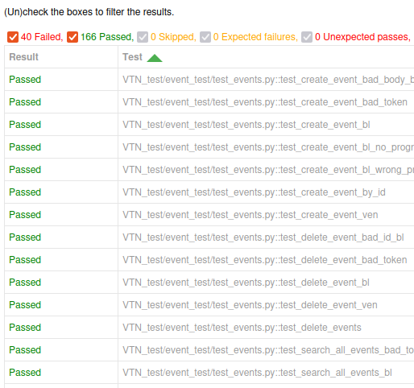

[](https://www.bestpractices.dev/projects/9656)
[](https://insights.linuxfoundation.org/project/openleadr/repository/openleadr-openleadr-rs)


# OpenADR 3.0 in Rust


This repository contains an OpenADR 3.0 client (VEN) library and a server (VTN) implementation, both written in Rust.
OpenADR is a protocol for automated demand-response in electricity grids, like dynamic pricing or load shedding.
The [OpenADR alliance](https://www.openadr.org/) is responsible for the standard,
which can be [downloaded](https://www.openadr.org/specification) free of charge.

This implementation is still work-in-progress.
In particular, **we started implementing the OpenADR 3.1 specification** in the [`openadr3_1` branch](https://github.com/OpenLEADR/openleadr-rs/tree/openadr3_1).
Once the changes are complete, we will merge them into the `main` branch and will discontinue support for OpenADR 3.0.
Please note that the changes of 3.1 compared to 3.0 are not backwards compatible. 
At the moment, we don't plan to offer upgrade instructions from OpenADR 3.0 to 3.1 as we don't expect a need for that.
Feel free to reach out if this assumption seems wrong.

Thanks to our sponsors [ElaadNL](https://elaad.nl/en/) and [Tweede golf](https://tweedegolf.nl/en)
for making this work possible.

## Documentation

The documentation of the project is an ongoing effort as part of the first release.
The [`./openleadr-client`](./openleadr-client) and [`./openleadr-vtn`](./openleadr-vtn) contain Readmes on how to get
started with the client library and server, respectively.
Additionally, the [client](https://crates.io/crates/openleadr-client), [server](https://crates.io/crates/openleadr-vtn),
and [common data types](https://crates.io/crates/openleadr-wire) are published to crates.io
and have documentation available on docs.rs.
As an addition, [#17](https://github.com/OpenLEADR/openleadr-rs/issues/17) aims
to produce a detailed OpenAPI specification of the VTN API we provide.

## Getting started

### First time setup

Your machine needs a recent version of Rust installed.
Please refer to the [official installation website](https://rustup.rs/) for instructions for your platform. To apply the database migrations, you also need the sqlx-cli installed.
Simply run `cargo install sqlx-cli`. Additionally, you need `postgresql-client` installed (version 16 or newer).

### Docker compose

For a quick start,
this repository contains a [`docker-compose.yml`](docker-compose.yml) with the VTN and a Postgres database.
To start it, first start the database and run the migrations:

```bash
docker compose up -d db # start the DB
cargo sqlx migrate run  # apply the migrations
docker compose up -d    # start all other containers, i.e., the VTN
```

Afterward, the VTN should be reachable at `http://localhost:3000`.

For a more detailed guide,
please refer to the Readmes in the [`./openleadr-client`](./openleadr-client) and
[`./openleadr-vtn`](./openleadr-vtn) directories.

## Supported features

This repository contains only OpenADR 3.0, older versions are not supported.

Currently, real-time updates via the webhook mechanism, known as subscriptions in the specification, are not supported.
While we currently do not plan to add this ourselves, we warmly welcome any contribution or sponsoring to add it.
See the [Contributing section](#contributing) if you are interested.

The VTN implements its own OAuth provider, which is mainly relevant for testing and prototyping.
Besides that, the VTN can also be configured to use a third-party OAuth provider,
see the [documentation](./openleadr-vtn/README.md#internal-vs-external-oauth-provider) for details.

The client and server do support creating, retrieving, updating,
and deleting programs, events, reports, VENs, and resources.
Both sides support authentication and authorization handling
and optionally allow for a more fine-grained access control than required by the specification.

The VTN stores the data in a Postgres database,
but the code base is ready for using other data stores as well in the future.
Again, we warmly welcome contributions or sponsoring if you are interested in adding additional storage support.

The VEN is a library for conveniently interacting with the REST API provided by a VTN.
We aim for a clean and easy-to-understand API of the library to be used by business or VEN logic.
Additionally, we will use the library to create a CLI application for easy testing and prototyping,
see [#52](https://github.com/OpenLEADR/openleadr-rs/issues/52) for the current progress.

## Testing
The Rust tests in this repository cover most of the functionality.
We use [CodeCov](https://app.codecov.io/gh/OpenLEADR/openleadr-rs/) to keep track of the test coverage,
and have an outstanding issue [#75](https://github.com/OpenLEADR/openleadr-rs/issues/75)
to improve the test coverage even further.
These tests are executed in GitHub Actions on every pull request.
To execute them locally, run:

```bash
docker compose up db -d     # start up a Postgres DB in the background
cargo sqlx migrate run # apply the DB scheme
# load default credentials for integration testing of the client library
psql -U openadr -W openadr -h localhost openadr < fixtures/test_user_credentials.sql
cargo test --workspace      # execute the tests
```

In addition to the tests we developed ourselves, there exists a test suite maintained by the OpenADR alliance.
As it is closed source, we cannot integrate this test suite with the CI, unfortunately.
Nevertheless, we executed the tests locally to check for incompatibilities.
Currently, all except for two of the 168 test cases that are applicable for us pass.

The two failing test cases are a result of that we do the permission management a bit different from the specification.
In particular, we do not allow VENs to delete their own reports but instead allow this to the business logic (BL).
The two test cases assume the opposite, VENs should be able to delete reports, and BLs should not be able to.
See also [#11](https://github.com/OpenLEADR/openleadr-rs/issues/11).

The following screenshot shows the test results of the test suite from the OpenADR alliance,
executed against commit [`5c4e281`](https://github.com/OpenLEADR/openleadr-rs/tree/5c4e281fdc96f7332675325e0d4da8cc1005dfe2).
The 38 failing tests not mentioned before are testing the *subscription*
feature not supported by this application yet.
See also [Supported features](#supported-features).



## Contributing
We expect you to follow our [code of conduct](CODE_OF_CONDUCT.md) for any contribution.

If you are missing a feature or see unexpected behavior,
do not hesitate to open an issue on our [GitHub](https://github.com/OpenLEADR/openleadr-rs) page.
If you suspect a security-critical issue, please refer to [`SECURITY.md`](SECURITY.md).

Additionally, we are happy to see pull requests on this repository as well.
We prefer to know when you intend to develop some functionality to make sure that there aren't multiple people working on the same issue. Simply drop a short note to the corresponding issue.

For your commits, please make sure you add a `signed-off-by` appendix to your commit message,
as the [LF energy contribution guidelines](https://tac.lfenergy.org/process/contribution_guidelines.html#developer-certificate-of-origin) require that.
By doing so, you acknowledge the text in [`CONTRIBUTING`](CONTRIBUTING).
The easiest way is to add a `-s` flag to the `git commit` command, i.e. use `git commit -s`.

If you are interested in contributing but don't know where to start,
check out issues marked as [good first issue](https://github.com/OpenLEADR/openleadr-rs/issues?q=is%3Aissue+is%3Aopen+label%3A%22good+first+issue%22)
or [help wanted](https://github.com/OpenLEADR/openleadr-rs/issues?q=is%3Aissue+is%3Aopen+label%3A%22help+wanted%22),
or simply open an issue and ask for good starting points.

## Interoperability
The code in this repository is written in Rust.
Nevertheless, you can combine the server, i.e.,
VTN implementation with a client, i.e., VEN witten in any language you prefer, such as Python, Node.js, or Java.
This is simply because the VTN is a stand-alone binary and the interactions with the VEN happen over HTTP.

If your business or client logic is written in Rust,
you may be interested in using the client library of this repository as well.
It is mainly a thin layer to abstract the HTTP interaction with the VTN.
Thus, if your application is written in another language than Rust,
it is most likely less work
to write a small HTTP abstraction layer yourself
than using a language interoperability layer on top of our client library.

## Help us make an impact: We're seeking funding!

We're currently seeking funding before taking the next crucial steps. In particular: delivering an **official field-test-ready release**. This way, you, as an (early) adopter can have greater confidence in the project's long-term sustainability.

Funding is managed by [Trifecta Tech Foundation](https://trifectatech.org) (TTF), a nonprofit (501(c)(3) equivalent) public benefit organization that provides a long-term home for open-source projects that are crucial for critical infrastructure.

For more details about our plans for 2025 and beyond please visit the [project's page](https://trifectatech.org/initiatives/automated-demand-response/) on Trifecta Tech Foundation's website.

### Current sponsors
- [ElaadNL](https://elaad.nl/en/)
- [Tweede golf](https://tweedegolf.nl/en)
